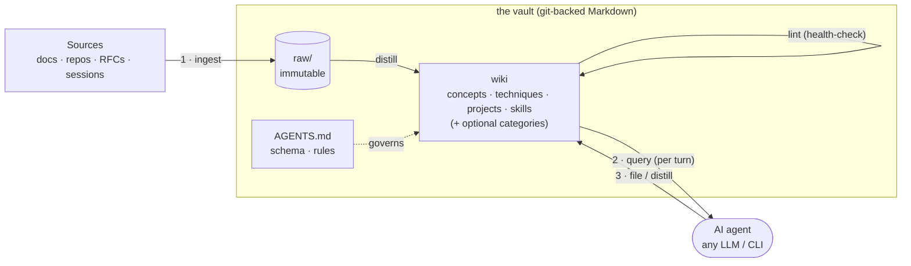

# Synapse — Karpathy's LLM Wiki, made installable

[](LICENSE)
[](#install)
[](https://obsidian.md)

> A shell-native, drop-in implementation of [Andrej Karpathy's **LLM Wiki**](https://gist.github.com/karpathy/442a6bf555914893e9891c11519de94f):
> immutable sources in, an LLM-owned wiki of interlinked Markdown out. Your agent
> **queries the wiki before work** and **ingests what it learns after** — persistent memory
> that compounds across sessions. Plain files you own. No database, no RAG, no lock-in.

> **Model- and tool-agnostic.** The wiki is plain Markdown + a `synapse` shell CLI, so it
> works with **any LLM and any agentic CLI** — Claude Code, Codex, Gemini, OpenCode, Cursor,
> and anything that can read a file or run a command. One `setup` wires the right context
> file for each; nothing about the vault is tied to a vendor.

```bash
curl -fsSL https://raw.githubusercontent.com/AJSubrizi/synapse/main/scripts/get.sh | bash

synapse setup claude-code     # or: codex | gemini | opencode | cursor
synapse hooks install         # Claude Code: wire the per-turn continuous loop (optional)
```

That's it — your agent now reads and grows a knowledge base on every session.


## How it works

Karpathy's pattern is **three layers** and **three operations**. Synapse makes each one a
command and keeps the whole thing as Markdown in a git repo.



| Layer | What it is |
| --- | --- |
| **`raw/`** | Immutable original sources. Read, never edited — superseded, not rewritten. Pragmatic: used when you ingest an external source (session-distilled knowledge skips it). |
| **wiki** | The LLM-owned Markdown derived from `raw/`, wired with `[[wikilinks]]`. **Configurable categories** (`_meta/categories`): core `concepts/` `techniques/` `projects/` `skills/`; optional, on demand, `sources/` `analysis/` `people/` `organizations/` `journal/`. |
| **schema** | `AGENTS.md` — the conventions the agent follows so the wiki stays coherent. |

> `techniques/` vs `skills/`: a **technique** is a described pattern you reference; a
> **skill** is an executed procedure the agent runs and *rates* (scorecard via `synapse skill`).

| Operation | Command | Does |
| --- | --- | --- |
| **ingest** | `synapse ingest <file\|url>` | Copies the source to `raw/`, then **creates** the linked `sources/` page + `index.md` entry + `log.md` line. The agent only fills the body. |
| **query** | `synapse query <q>` | Ranked retrieval; surfaced automatically every turn via hooks. Good answers get filed back with `synapse file` so knowledge compounds. |
| **lint** | `synapse lint` | Health-check: broken links, orphans, staleness, near-duplicates, frontmatter gaps. |

Mapped onto a coding session: **query before work → work with context → ingest/distill if
meaningful → lint before close.** The hooks make that loop automatic (see below).

A wiki only earns its keep if it keeps growing — so `synapse metrics` measures whether the
loop is live: page count and growth, ingest/file activity, retrieval coverage, and a blunt
warning when distillation has gone quiet.

## Why not just RAG?

RAG re-derives from raw chunks on every query and never retains anything — perpetually
amnesiac. The LLM Wiki **compiles knowledge once** into interlinked notes and keeps them
current. It's plain Markdown: diffable, browsable in Obsidian, owned by you.

## The continuous loop

A vault read once at session start drifts out of context. Every CLI keeps the loop alive —
the mechanism just differs by how much the tool exposes:

- **Any CLI** — `synapse setup <target>` writes the agent's context file (`CLAUDE.md` /
  `AGENTS.md` / `GEMINI.md`) pointing at the vault, so the agent runs Phase 0 (query before
  work) and distills after. This alone is portable across every tool and model.
- **Claude Code (deepest integration)** — `synapse hooks install` adds per-turn automation
  via a safe, idempotent merge into `~/.claude/settings.json` (backs up to `.bak`, preserves
  your other settings):

  ```bash
  synapse hooks install     # SessionStart + UserPromptSubmit + Stop   (synapse hooks print to preview)
  ```

  - **SessionStart** — inject the vault bootstrap context.
  - **UserPromptSubmit** — rank the wiki against *every* prompt and inject the top notes (instant, no model) so memory resurfaces each turn.
  - **Stop** — if notes changed, run `synapse lint` and block on errors; if you changed code but wrote no notes, nudge to distill. (Silence with `SYNAPSE_DISTILL_NUDGE=0`.)

Codex, Gemini, OpenCode and Cursor get the same `ingest`/`query`/`file`/`lint` commands and
the Phase-0 loop today; equivalent per-turn hooks land as each CLI exposes them.

## Commands

```bash
synapse ingest SRC      # record a file/URL under raw/ + create a linked sources/ page
synapse query QUERY     # ranked retrieval (BM25 by default, or a built index)
synapse file CAT TITLE  # file knowledge back as a wiki page (frontmatter + index + log)
synapse lint [--strict] # health-check the wiki (alias: check); --git-staleness for git-based age
synapse metrics         # loop metrics: size, growth, activity, retrieval, stall signal
synapse hooks install   # wire the continuous-loop hooks
synapse setup TARGET    # write the agent context file (claude-code|codex|cursor|gemini|opencode)
synapse <cli>           # run an agent (claude|codex|gemini|opencode) with the vault loaded
synapse vault [NAME]    # list / switch / create vaults (separate domains, one switch)
synapse skill ...       # rated skills library: list | use | rate | suggest | deps | show
synapse status | doctor | env | digest | index | reinit
```

`brain` stays a symlink to `synapse` for backward compatibility.

## Retrieval & benchmarks

The wiki works with just `[[wikilinks]]`; optional **offline, file-based** retrieval helps
the agent find notes as it grows. The default **BM25** backend needs no dependencies (opt-in
embeddings + hybrid via `synapse index --backend embeddings|hybrid`, degrading cleanly to BM25).

Measured fully offline, zero API cost:

| Dataset | Granularity | Recall@5 | nDCG@10 (95% CI) |
| --- | --- | --- | --- |
| [LongMemEval-S](https://github.com/xiaowu0162/LongMemEval) | session | **91.2%** | **89.8% [88.0, 91.8]** |
| [LoCoMo](https://github.com/snap-research/locomo) | session | 83.6% | 77.1% [74.8, 79.7] |

Retrieval-only numbers (not comparable to LLM answer-accuracy). Method, full tables, optional
end-to-end answer/distillation tracks, and one-command reproduction: [`benchmarks/`](benchmarks/).

## More

- **Extensions over the baseline** — a *rated* skills library (`skills/` notes carry scorecards, deps, versioning via `synapse skill`), multi-vault switching, and a built-in quality gate are Synapse additions on top of Karpathy's pattern.
- **Add content by hand** — drop a Markdown file in the right folder; the agent normalizes frontmatter, cross-links, and catalogs it. Worked example: [`examples/distillation/`](examples/distillation/).
- **Architecture & custom layouts** — [docs/ARCHITECTURE.md](docs/ARCHITECTURE.md), [docs/CUSTOM-LAYOUT.md](docs/CUSTOM-LAYOUT.md).
- **Try it with no install** — `./scripts/demo.sh` runs the full learn → write → recall loop in a throwaway vault.
- **Token cost** — a typical session is ~5k–7k tokens (boot + 1–3 selective reads).

Default paths: `~/Synapse/vault` (knowledge base) · `~/.local/bin/synapse` (CLI). Point at an
existing vault with `SYNAPSE_HOME=... BRAIN_VAULT=... ./install.sh`. Uninstall: `./uninstall.sh`
(add `--delete-vault` to remove the vault too).

## FAQ

**Do I need Obsidian?** No — Markdown files only; Obsidian is optional for graph browsing.
**Former name?** Agent Brain Runtime; the repo and product are now Synapse.
**Pairs with?** [RTK](https://github.com/rtk-ai/rtk) for short-term token savings.

## License

MIT — see [LICENSE](LICENSE).
