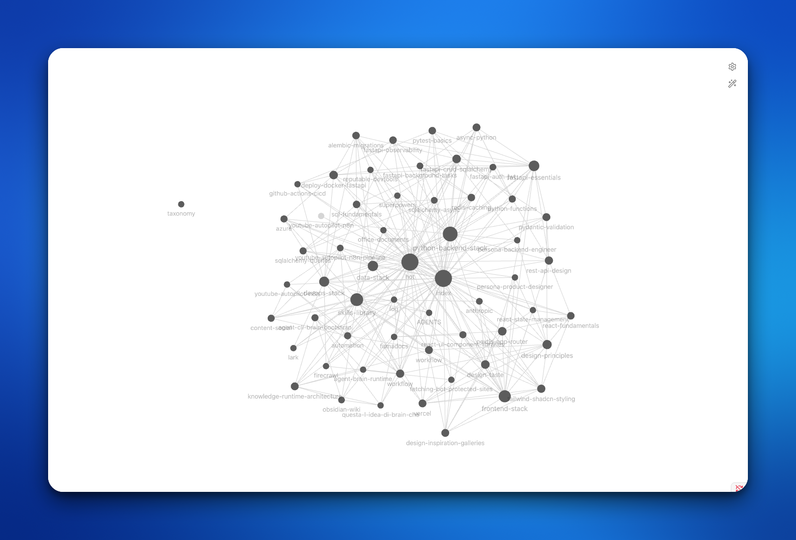

# Synapse — Persistent Memory for AI Coding Agents

[](LICENSE)
[](#install)
[](https://obsidian.md)

> **Give your AI coding agents long-term memory.** Synapse is an open-source,
> shell-native knowledge base: agents **read an Obsidian-compatible vault before work**
> and **distill what they learn after** — plain Markdown, no database, no lock-in.

Synapse is a lightweight persistent-memory layer for agentic CLIs (Claude Code, Codex,
Gemini, OpenCode, Cursor Agent, and others). It ships a rated **skills library** pattern
(scorecards on Markdown procedures) and pairs well with [RTK](https://github.com/rtk-ai/rtk)
(short-term token savings).



> A real vault, viewed in Obsidian. Each node is a Markdown note — skills
> (`skills-library`, `frontend-stack`), conventions (`tailwind-shadcn-styling`,
> `rest-api-design`), and project knowledge — wired together with `[[wikilinks]]`
> the agent walks before it works.

**Highlights**

- **Plain Markdown, no database, no lock-in** — your memory is files you own, browsable in Obsidian or any editor.
- **Works with any agentic CLI** — Claude Code, Codex, Gemini, OpenCode, Cursor; wired up in one command (`synapse setup`).
- **Rated skills library** — reusable procedures with scorecards, dependencies, and versioning.
- **Optional file-based retrieval** — search, ranked query, and a TF-IDF index, all offline; **BM25 hits ~90% nDCG@10 on LongMemEval** ([benchmarks](#benchmarks)).
- **Quality gate built in** — `synapse check --strict` keeps the vault from rotting over many distillation cycles.

## Contents

- [Install](#install)
- [Quick start](#quick-start)
- [How it works](#how-it-works)
- [Commands](#commands)
- [Retrieval](#retrieval-optional)
- [Benchmarks](#benchmarks)
- [Multiple vaults](#multiple-vaults)
- [What to put in a vault](#what-to-put-in-a-vault)
- [Adding content](#adding-content)
- [Skills library](#skills-library-rated)
- [Token cost](#token-cost)
- [Claude Code hooks](#claude-code-hooks)
- [Custom layouts](docs/CUSTOM-LAYOUT.md)
- [Uninstall](#uninstall)
- [FAQ](#faq)

## Install

```bash
git clone https://github.com/AJSubrizi/synapse.git
cd synapse
./install.sh
```

Default paths:

```text
~/Synapse/vault          # Obsidian-compatible knowledge base
~/.local/bin/synapse     # CLI (brain -> synapse symlink)
```

Verify:

```bash
synapse doctor
synapse env
```

Point at an existing vault:

```bash
SYNAPSE_HOME="$HOME/My-Brain" BRAIN_VAULT="$HOME/My-Brain/vault" ./install.sh
```

## Quick start

```bash
# 1. wire your agent to the vault (writes CLAUDE.md / AGENTS.md / GEMINI.md here)
synapse setup claude-code        # or: codex | cursor | gemini | opencode

# 2. run the agent with the vault environment loaded
synapse claude                   # or: codex | opencode | gemini

# 3. after work, the agent distills; you keep the vault healthy
synapse check --strict
```

With shell integration (`synapse reinit`), aliases like `codex` route through Synapse.

## How it works

```text
read vault (Phase 0) -> work with context -> distill if meaningful -> synapse check
```

Exports include `SYNAPSE_HOME`, `BRAIN_VAULT`, `BRAIN_LOADED`, `BRAIN_SESSION_ID`,
`BRAIN_VAULT_HASH`, and Obsidian-compatible paths. Normal dev commands (`git`, `npm`) are
**not** intercepted — only agentic CLIs.

Workflow details: `vault/_meta/workflow.md` (Phase 0, Phase 0-short, meaningful work,
staleness, subagents).

## Commands

```bash
synapse status         # active? vault, session, staleness
synapse vault          # list vaults / show active
synapse vault NAME     # switch to (or create) a named vault
synapse setup TARGET   # install agent context file (claude-code|codex|cursor|gemini|opencode)
synapse check          # validate + dedup + skill deps (read-only)
synapse check --strict # also fail on distillation-quality issues (CI-friendly)
synapse search QUERY   # filter notes by query, tag, or title (--tag/--title/--exact)
synapse query QUERY    # ranked retrieval (lexical, or semantic via the built index)
synapse digest         # (re)write _meta/digest.md — a compact map of the vault
synapse index          # build optional retrieval index (--backend tfidf|embeddings)
synapse doctor         # boot files exist?
synapse skill list     # ranked skills library
synapse skill suggest CONTEXT   # recommend a skill for the task
synapse skill deps     # skill dependency graph (flags broken requires)
synapse reinit         # rewrite shell-rc Synapse block
synapse env
synapse <cli>          # run agent with vault env
```

`brain` remains a symlink to `synapse` for backward compatibility.

### Retrieval (optional)

The vault works with just the agent + `[[wikilinks]]`. As it grows, three optional,
**file-based** layers help the agent *find* the right notes — no database, ever:

- `synapse search` — fast grep-based lookup with `--tag` / `--title` / `--exact` filters.
- `synapse query` — ranked retrieval that weights title/tags/summary over body (uses the
  index if built, else a lexical fallback).
- `synapse digest` — a single `_meta/digest.md` map the agent can read in Phase 0
  instead of the whole vault.
- `synapse index` + `synapse query` — a local TF-IDF index by default; an embeddings
  backend is opt-in via `SYNAPSE_RETRIEVAL_BACKEND=embeddings` and degrades cleanly to
  TF-IDF if the optional model isn't installed.

See a worked distillation example in [`examples/distillation/`](examples/distillation/).

## Benchmarks

Retrieval is measured on two long-conversation memory datasets — **fully offline, zero API
cost**, with the no-dependency BM25 backend:

| Dataset | Granularity | Questions | Recall@5 | nDCG@10 (95% CI) |
| --- | --- | --- | --- | --- |
| [LoCoMo](https://github.com/snap-research/locomo) | turn | 1,982 | 46.6% | 39.8% [37.6, 41.7] |
| [LoCoMo](https://github.com/snap-research/locomo) | session | 1,982 | 83.6% | 77.1% [74.8, 79.7] |
| [LongMemEval-S](https://github.com/xiaowu0162/LongMemEval) | session | 470 | **91.2%** | **89.8% [88.0, 91.8]** |

Session granularity is closer to how Synapse stores distilled notes (not raw turns), and a
second dataset shows the retriever generalises. These are **retrieval-only** numbers —
*not* comparable to LLM answer-accuracy figures from papers. Method, full per-category
tables, and one-command reproduction live in
[`benchmarks/`](benchmarks/) (both datasets share
[`retrieval_eval.py`](benchmarks/retrieval_eval.py), so results are directly comparable).

## Multiple vaults

Keep separate knowledge bases for separate domains and switch between them with one
command — the next `synapse <cli>` launch picks up the active vault automatically.

```bash
synapse vault cybersecurity   # create + switch (first run scaffolds it)
synapse vault web-design      # switch to another domain
synapse vault                 # list vaults, '*' marks the active one
synapse vault default         # back to the default ~/Synapse/vault
```

Named vaults live under `~/Synapse/vaults/<name>` and inherit the engine + workflow from
your current vault, starting with an empty knowledge surface. The active vault is recorded
in `~/Synapse/.active-vault`. Setting `BRAIN_VAULT` explicitly pins a vault and bypasses the
switcher.

## What to put in a vault

A vault is just Markdown the agent reads in Phase 0. Some patterns that pay off:

**Skills** — reusable, rated procedures under `skills/`:

```markdown
---
title: Deploy FastAPI to Docker
tags: [skills, backend, devops]
---
1. Build: `docker build -t app .`
2. Run migrations: `alembic upgrade head`
3. Health-check `/healthz` before flipping traffic.
```

**Security rules** — guardrails the agent must honor before touching code:

```markdown
---
title: Security baseline
tags: [security]
---
- Never log secrets, tokens, or PII; redact in error paths.
- All new endpoints require authz checks + input validation.
- Treat user input as hostile: parametrize queries, no shell interpolation.
```

**Working on a huge legacy codebase** — conventions that keep the agent from breaking things:

```markdown
---
title: Legacy monolith — rules of engagement
tags: [project, architecture]
---
- Read `concepts/architecture.md` before editing any module.
- Change one module per PR; no cross-cutting refactors without sign-off.
- The `billing/` package is load-bearing and untested — add tests before edits.
- Match the surrounding style; do not introduce new frameworks.
```

Link related notes with `[[wikilinks]]` so the agent can traverse from one to the next.

## Adding content

A vault is plain Markdown — there is no import step. The recommended workflow is
**you write the high-signal content by hand, the agent normalizes the rest.**

### 1. Drop a Markdown file in the right folder

| Folder | Holds |
| --- | --- |
| `skills/` | Rated, reusable procedures (the [skills library](#skills-library-rated)) |
| `concepts/` | Durable ideas, conventions, mental models |
| `references/` | External facts, API notes, cheat sheets |
| `projects/` | Per-project knowledge and decisions |
| `entities/` | People, services, systems you keep referring to |
| `synthesis/` | Hubs that tie many notes together (use once the index passes ~80 entries) |
| `journal/` | Quick capture / dated notes to refine later |

The minimum is a title and a body — don't sweat the metadata:

```markdown
# Rate-limit FastAPI endpoints

Use `slowapi` with a Redis backend. Decorate routes with `@limiter.limit("5/minute")`.
Return 429 with a `Retry-After` header.
```

### 2. Let the agent finish it

In your next session, point the agent at the note and ask it to **file it into the
vault**. Following `_meta/workflow.md`, it will:

- add the required frontmatter (`title`, `category`, `tags`, `sources`, `summary`,
  `created`, `updated`) — tags drawn from `_meta/taxonomy.md`;
- add `[[wikilinks]]` to related notes;
- register it under the right heading in `index.md`;
- run `synapse check` (validate + near-duplicate detection).

### 3. Or hand the agent a source to ingest

When you launch an agent through Synapse (`synapse claude`, `synapse codex`,
`synapse gemini`, …) the vault is already loaded. Point it at an external source — a URL,
a Git repo, a local document — and ask it to add it:

```text
"Read https://github.com/owner/repo and add a concept note on its architecture to the vault."
"Ingest this RFC (URL or file) into references/ and link it to [[rest-api-design]]."
"Clone <repo>, summarize its auth flow, and save it as a skill."
```

The agent fetches the page / repo / document with its own tools, distills it into atomic
notes, records where it came from in the `sources:` frontmatter, cross-links, updates
`index.md`, and runs `synapse check`. Keep the source concrete (a link, a path, a repo) so
the note stays traceable back to its origin.

If you'd rather write it fully by hand, the complete frontmatter looks like:

```markdown
---
title: Rate-limit FastAPI endpoints
category: references
tags: [backend, security]
sources: [team-runbook]
summary: Per-route rate limiting with slowapi + Redis, returning 429 + Retry-After.
created: 2026-06-17T00:00:00Z
updated: 2026-06-17T00:00:00Z
---
```

Validate any time with:

```bash
synapse check
```

Skills are the same flow plus a scorecard block (`uses`, `score`, `votes`, `last_used`)
managed by `synapse skill` — see [Skills library](#skills-library-rated).

## Skills library (rated)

Skills are Markdown procedures with a **scorecard** in their frontmatter (`uses`, `score`,
`votes`, `last_used`), so the vault becomes a *rated* library, not just notes. The starter
vault ships two — `distill-after-work` and `file-into-vault` (the
[Adding content](#adding-content) procedure). Add your own under `vault/skills/` or use a
[custom layout](docs/CUSTOM-LAYOUT.md) for monorepo skill dirs.

```bash
synapse skill list                       # ranked by score, then uses
synapse skill use     distill-after-work # +1 use after applying it
synapse skill rate    distill-after-work 5 "saved a re-derive"
synapse skill suggest "ingest a repo"    # recommend a skill for the task
synapse skill deps                       # dependency graph (flags broken requires)
synapse skill show    distill-after-work # scorecard, version, dependencies
```

Skills can declare dependencies (`requires: [[other-skill]]`) and a `version`; `synapse
check` reports the dependency graph and flags broken links.

## Token cost

On a ~56-page vault, a typical Synapse-aware session is **~5k–7k tokens** (boot +
1–3 selective reads). Use `index → summary → body` and `synthesis/` hubs when the index
grows past ~80 entries.

## Claude Code hooks

Templates in `templates/vault/_meta/hooks/`:

- `session-enforce.sh` — inject bootstrap on SessionStart / SubagentStart
- `stop-check.sh` — `synapse check` only when `vault/` has git changes

## Uninstall

```bash
./uninstall.sh              # keeps ~/Synapse
./uninstall.sh --delete-vault # removes vault too
```

## FAQ

### What is Synapse?

Open-source persistent memory for AI coding agents: a portable vault + `synapse` shell shim.

### Former name?

This project was **Agent Brain Runtime** (`agent-brain-runtime`). Repo and product are now **Synapse**.

### Do I need Obsidian?

No. Markdown files only; Obsidian is optional for graph browsing.

## License

MIT — see [LICENSE](LICENSE).
